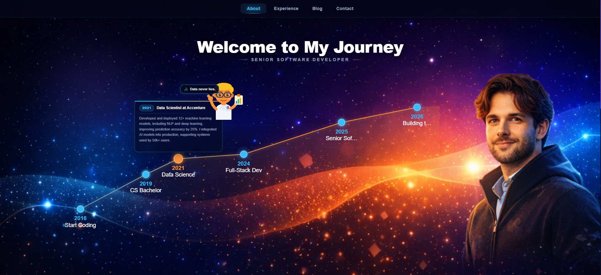
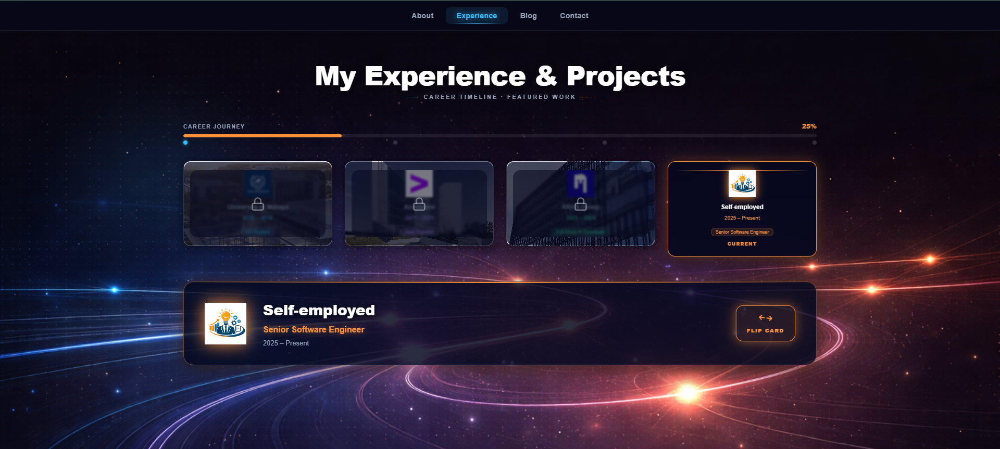

# Alejandro — Portfolio

Personal portfolio of **Alejandro Moral**, Senior Software Developer specializing in Python, React, AI/ML, and cloud-native systems.

## Quick Start

```bash
npm install
npm run dev
```

Open **http://localhost:5173** in your browser.

---

## Pages

### About `/`

The landing page. Features an interactive career timeline (2016 → 2026), animated mascot characters, a rotating engineering philosophy carousel, and a skills progress section.



**Highlights:**
- Click any milestone dot on the timeline to reveal career details
- Skills bars: Python 95%, React/Next.js 90%, Machine Learning 92%, System Design 94%
- Story video player at the bottom

---

### Experience `/experience`

Showcases work history across 4 companies with a 3D flip card system and project gallery.



**How to use:**
- Click a company tab (University → Accenture → ARHS Group → Self-employed)
- Click **Flip Card** to reveal achievements
- After flipping, a project grid appears — click any project card for full details
- Self-employed tab has category filters: Web, AI, Wordpress, Excel

---

### Blog `/blog`

Engineering journal with articles on AI systems, backend development, and cloud infrastructure.

**Features:**
- 9 post cards in a responsive grid
- Each card shows a tag, title, excerpt, and 5-trophy achievement rating
- Topics: LLM pipelines, Kubernetes, BERT fine-tuning, Kafka, React performance

---

### Contact `/contact`

Three-mode contact system backed by Telegram bot notifications.

**How to use:**
1. Choose a mode: **Hire Me**, **Collaborate**, or **Just Say Hi**
2. Fill in the form and hit Send — message goes directly to Telegram
3. Scroll down for the **Portfolio Assessment** section — click criteria cards to rate, submit a star rating and recommendation

**Setup required** — create a `.env` file:
```
VITE_TELEGRAM_BOT_TOKEN=your_bot_token
VITE_TELEGRAM_CHAT_ID=your_chat_id
```

---

## Tech Stack

| Layer | Technology |
|---|---|
| Framework | React 19 + TypeScript |
| Build | Vite 8 |
| Styling | Tailwind CSS 4 |
| Animation | Framer Motion 12 |
| Routing | React Router 7 |
| Icons | Lucide React |

## Project Structure

```
src/
├── pages/
│   ├── AboutPage.tsx       # Landing / career timeline
│   ├── ExperiencePage.tsx  # Work history + projects
│   ├── BlogPage.tsx        # Engineering journal
│   └── ContactPage.tsx     # Contact forms + assessment
├── components/             # Shared UI components
└── App.tsx                 # Router setup
public/
├── Alejandro_M.pdf         # CV download
├── experience.png          # Experience page background
└── logos/                  # Company logos
```
